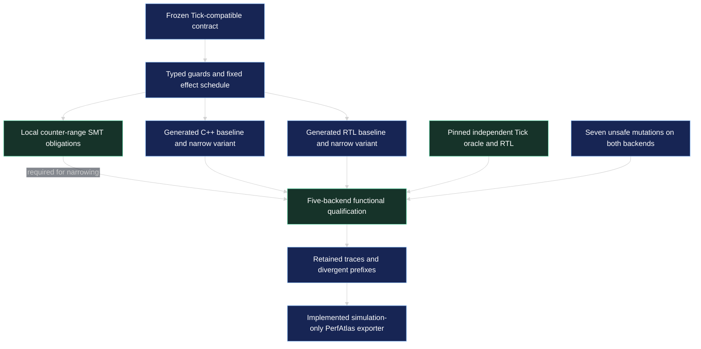

# Apex_ContractForge

**A bounded transition compiler for CPU and FPGA implementations, starting with one frozen Tick-compatible order-admission profile.**

ContractForge generates C++ and SystemVerilog from typed guard expressions and a fixed ordered-effect template. A qualification runner compares both baseline and counter-narrowed variants against a pinned independent dictionary oracle and the original Apex_Tick RTL. Seven deliberately unsafe transformations must be detected on both generated backends.

This is an executable first compiler slice. It supports **one frozen profile**, not arbitrary C++, Python, exchange protocols or user-defined state machines. FPGA deployment, full stateful RTL equivalence, physical latency, LUT savings, energy measurements, measured Pareto improvements and official STAC execution remain unqualified.

## What is implemented

| Component | Scope |
|---|---|
| Semantic frontend | Rejects every alteration or unknown field in the frozen profile |
| Typed pure IR | Unsigned bit-vector guards, explicit 65-bit quantity sum and ordered effects |
| C++ backend | Single-executor functional replay; Clang/GCC extension for 128-bit arithmetic |
| SystemVerilog backend | Fixed commit schedule; eight instruments, sixteen pending entries, one output |
| Counter transform | Rate 32→7 bits; window 32→6 bits; required local Z3 obligations |
| Independent qualification | Generated C++/RTL baseline and narrowed variants plus original Tick RTL |
| Adversarial corpus | Fifteen named scenarios, reproducible randomized traces and explicit reset |
| Negative controls | Seven unsafe transformations, checked on C++ and RTL, with divergent replay prefixes |
| Evidence | Retained input and complete-state traces, manifests, source hashes and simulation-only Atlas export |

**51 fewer declared RTL counter bits is a code-generation result. Synthesis can already optimize unused bits; this number does not establish fewer flip-flops, LUTs, lower power or faster execution.**

## Reproduce

Requirements: Python 3.11+, a tested Clang or GCC with unsigned `__int128`, Icarus Verilog (`iverilog` and `vvp`), and Z3. Missing tools and unresolved required obligations fail rather than silently skip. Tested dependency versions are recorded in `requirements-tested.txt`; CI uses those pins. Install Icarus through your normal platform tooling.

```sh
python3 -m venv .venv
.venv/bin/python -m pip install -r requirements-tested.txt
.venv/bin/python -m pip install --no-build-isolation -e .
.venv/bin/python -m pytest -q
.venv/bin/apex-forge check contracts/tick-compatible.json
.venv/bin/apex-forge prove-counters
.venv/bin/apex-forge compile --variant narrow-counters --output /tmp/apex-forge-generated
.venv/bin/apex-forge qualify --steps 2000 --seeds 17,29,53 --output /tmp/apex-forge-run
.venv/bin/apex-forge validate-evidence /tmp/apex-forge-run
.venv/bin/apex-forge export-atlas /tmp/apex-forge-run
```

Output directories must be absent or empty; existing evidence is not overwritten. `export-atlas` writes a new `run.json` once. To check it with [Apex_PerfAtlas](https://github.com/AAH20/Apex_PerfAtlas), run `apex-atlas validate /tmp/apex-forge-run/run.json` in an Atlas environment.

The randomized budget is at most one million cycles per qualification invocation, plus the deterministic corpus and scenario resets. Counts describe replay cycles, including idle, stalls and reset—not packets, orders or physical throughput. The testbench's artificial clock is not a device frequency measurement.

## Actual v0 execution architecture



The [ten full architecture views](docs/architecture/index.html) are the **broader proposed design**, with dark SVGs and editable Mermaid sources. Their private-environment, general search, vendor-shell, eFPGA and ASIC connections are future qualification work. [Release status](docs/release-status.md) separates the executable subset from those proposals.

## Semantics that must remain unchanged

- Readiness is sampled from pre-transition state.
- Reset overrides the normal transition. Observed pre-state readiness is recorded, but reset accepts no quote.
- An existing output handshake precedes terminal processing in that cycle.
- The rate window advances on every non-reset cycle, including idle and stalls.
- Recovery takes priority over terminal events; terminal events take priority over quotes.
- A terminal event can retire only a matching transmitted identity, once.
- Reservation commits quantity, identity, rate count, pending entry and output together.
- Hold prevents new admissions while preserving the reference policy for already reserved outputs.
- Hard reset erases local knowledge; a real adapter must reconcile external obligations before restoring authority.

The original profile has no terminal-epoch field. Adding it, retiming commits, changing the window to wall time, adding partial fills or changing capacity requires a new contract and new qualification. See [semantic rules](docs/semantics.md) and [verification scope](docs/verification.md).

## Apex ecosystem interfaces

| Project | Current relationship |
|---|---|
| [Apex_Tick](https://github.com/AAH20/Apex_Tick) | Pinned Apache-2.0 independent oracle and RTL baseline; provenance hashes retained |
| [Apex_PerfAtlas](https://github.com/AAH20/Apex_PerfAtlas) | Implemented file exporter; count-only functional simulation evidence |
| [Apex_ULL](https://github.com/AAH20/Apex_ULL) | Candidate future software baseline adapter; retains AGPL-3.0-or-later; no source copied |
| Frontier AI Compiler Kernel | Candidate future optimization-method adapter |
| ApexGraphSwarm | Candidate future search-lineage view |
| GRC_Claw | Candidate off-path release authorization/custody integration |
| RunProof / network-change twin | Separate workload theses; potential shared evidence vocabulary |

This project has no implemented Exegy adapter, exchange session, MAC/PHY, physical board runner or official STAC harness. [Hardware gates and economics](docs/hardware-and-economics.md) describe what those extensions require. No partnership, contract value or guaranteed benchmark win is implied.

## Qualification evidence

Retained releases live under `evidence/`. Run `apex-forge validate-evidence EVIDENCE_DIRECTORY` to replay the retained observations against the independent oracle and check source identity, count accounting and counterexample bindings. The evidence manifest establishes byte identity and local consistency, not authenticated custody or independent review.

The four local SMT obligations establish a counter invariant and narrowing value preservation under recorded transition assumptions. They do **not** prove the entire generated RTL state machine, the compiler, board integration, exchange correctness or physical timing.

## License and provenance

Original code, RTL templates and documentation are Apache-2.0. The attributed RTL template is derived from Apex_Tick; its independent oracle and RTL are vendored byte-for-byte from commit `1b665d3a0ec1fc106525edcece8a43b7254244e1`. See `NOTICE` and `src/apex_forge/reference/provenance.json`. Tools, hardware IP and benchmark materials retain their own terms.
